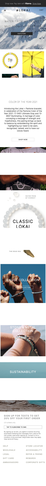
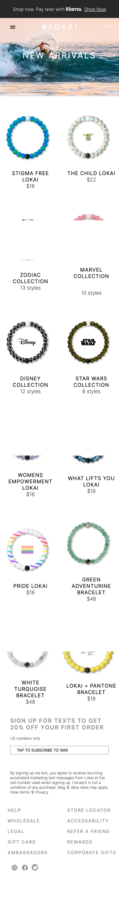
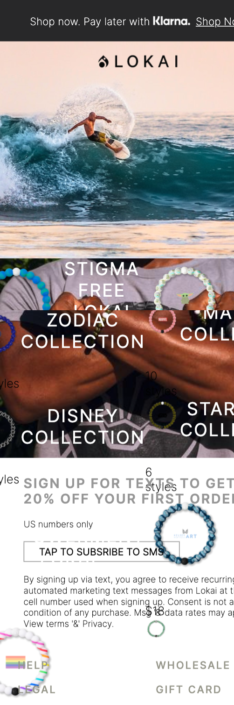
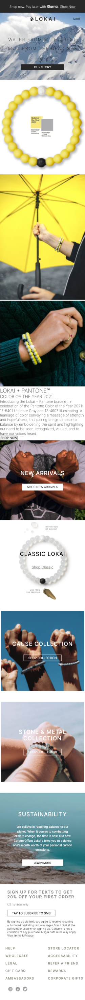
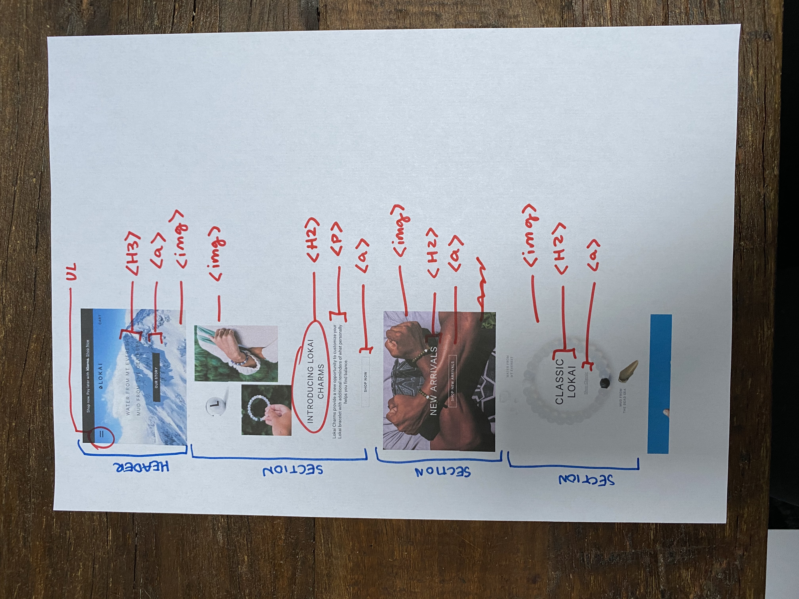
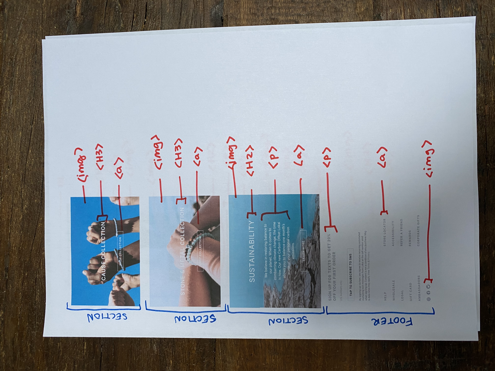
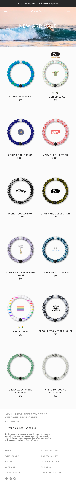

# Procesverslag
**Auteur:** Laura van Steveninck

Markdown cheat cheet: [Hulp bij het schrijven van Markdown](https://github.com/adam-p/markdown-here/wiki/Markdown-Cheatsheet). Nb. de standaardstructuur en de spartaanse opmaak zijn helemaal prima. Het gaat om de inhoud van je procesverslag. Besteedt de tijd voor pracht en praal aan je website.

## Bronnenlijst
1. https://thoughtbot.com/blog/css-animation-for-beginners
2. https://github.com/lisaoude/frontend2020
3. oefeningen uit de lessen 

## Eindgesprek (week 7/8)

### Wat ging er goed
Ik heb voor het eerst zonder heel veel hulp een website na kunnen maken. 
Ik heb alles echt stap voor stap opgepakt en heb er best wel van genoten dat het vaak heel goed ging. 
Ik ben echt best wel trots op het eindresultaat!

### Wat was lastig
Ik vond het hamburger menu heel erg moeilijk om te maken. Ik heb uiteindelijk ook hulp gevraagd aan een klasgenoot en alsnog is hij niet helemaal geworden zoals ik had gehoopt. 
Omdat ik alles zo stap voor stap heb gedaan had ik soms wel het gevoel dat ik heel erg langzaam was, dat was wel wat minder. 
Soms kwam ik erachter dat ik iets toch beter een andere naam kon geven in de html en dan moest ik alles in de css weer aanpassen, dat kostte soms wel echt veel tijd.

**Screenshot(s):**

-screenshot(s) van je eindresultaat-
Eindresultaat van de homepage

Eindresultaat van de tweede pagina

## Voortgang 3 (week 6)

keuze gemaakt om de afbeeldingen in de sections als background in de css te zetten, zo kan ik de tekst makkelijker stijlen. 

1-op-1 gesprekje met Deanna gehad (de anderen waren er niet). 
- gevraagd hoe ik de tekst het beste over de afbeeldingen heen kan zetten  --> met flexbox, en dan center (niet met positie absolute)
- paar issues met de <aside>, maar nu opgelost
- ik kom erachter dat ik soms als ik van plan verander ik bepaalde css laat staan die eigenlijk niet meer nodig is, dit dus even opschonen

## Voortgang 2 (week 5)

- html is zo goed als klaar. 
- stijling begonnen, maar nog niet echt tegen iets aangelopen.

## Voortgang 1 (week 3)

### Stand van zaken

- html is zo goed als klaar. 
- stijling begonnen, maar nog niet echt tegen iets aangelopen.

**Screenshot(s):**

-screenshot(s) van hoe ver je bent met korte uitleg-

### Agenda voor meeting

-samen met je groepje opstellen-

| student 1      | student 2          | student 3    | student 4        |
| ---            | ---                | ---          | ---              |
| dit bespreken  | en dit             | en ik dit    | en dan ik dat    |
| an dat ook nog | dit als er tijd is | nog een punt | dit wil ik zeker |
| ...            | ...                | ...          | ...              |

### Verslag van meeting

aantekeningen tijdens het gesprek 1:
- logo uit de ul halen 
- altijd door de validator halen 
- accessability check doen 
- main een id geven voor de stijling (omdat je twee verschillende pagina's hebt met één css)

## Breakdownschets (week 1)

## Intake (week 1)
-uitwerken voor de kick-off werkgroep - begin van de eerste week-

**Je startniveau:** -kies uit zwart, rood óf blauw-

Rode piste (maar zak af en toe in het blauw)

**Je focus:** -kies uit responsive óf surface plane-

Responsive

**Je opdracht:** -link naar de website die je gaat namaken óf de naam van je eigen ontwerp-

www.lokai.com

**Screenshot(s) van de eerste pagina (small screen):** Homescreen 

**Screenshot(s) van de tweede pagina (small screen):** New Arrivals

